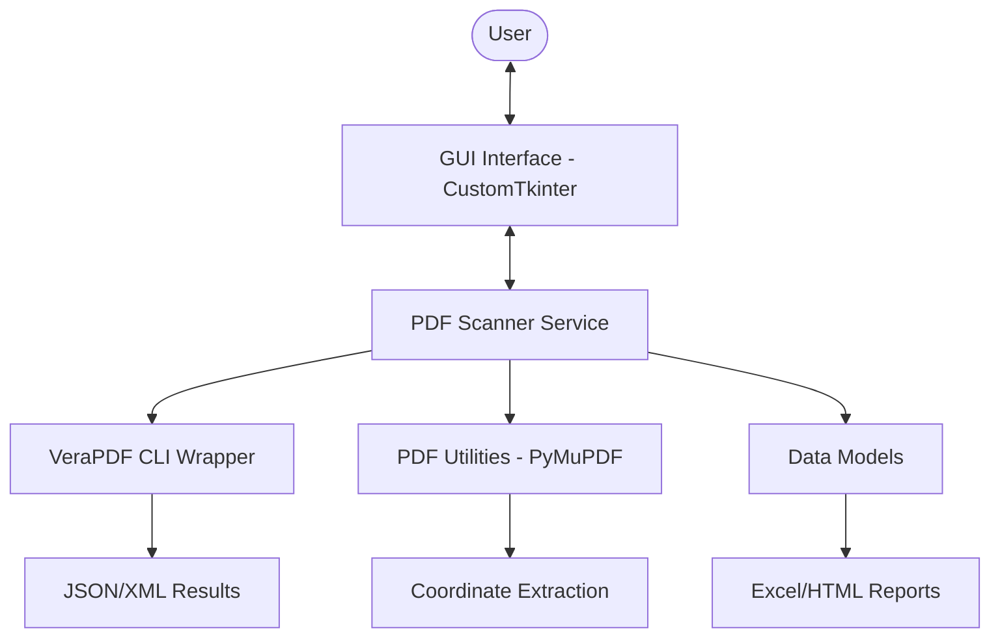
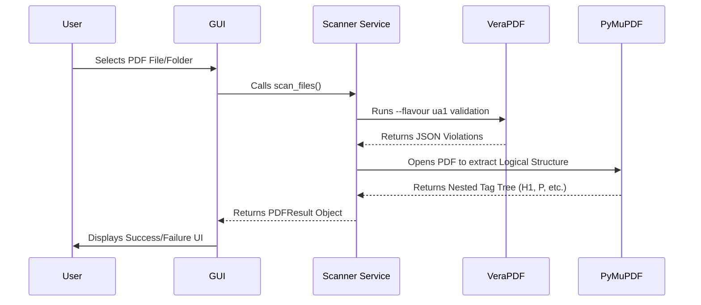

# WCAG PDF Scanner - Technical Documentation

## 1. Introduction
The WCAG PDF Scanner is a desktop utility designed to validate PDF documents against WCAG accessibility standards (PDF/UA-1). It provides a user-friendly interface to scan files, visualize errors, and inspect the logical structure (tags) of PDFs.

---

## 2. Technical Architecture

### Component Diagram

### Tech Stack
- **Language**: Python 3.10+
- **GUI Framework**: [CustomTkinter](https://github.com/TomSchimansky/CustomTkinter) (Modern UI)
- **PDF Engine**: [PyMuPDF (fitz)](https://pymupdf.readthedocs.io/) (Rendering and tag traversal)
- **Validation Engine**: [VeraPDF](https://verapdf.org/) (Standard-compliant PDF/UA validation)
- **Data Models**: Python Dataclasses

---

## 3. Prerequisites

| Requirement | Version | Purpose |
| :--- | :--- | :--- |
| **Python** | 3.10+ | Core language |
| **Java (JRE/JDK)** | 8+ | Required by VeraPDF |
| **VeraPDF** | 1.28.2+ | Compliance engine |
| **Internet** | Optional | Required only for initial setup |

---

## 4. System Flowchart (Scan Process)

---

## 5. User Journeys

### A. Scanning a Single PDF
1. Launch the application.
2. Click **"Select PDF File"**.
3. Choose a document and wait for the "Scan Progress" to complete.
4. View the status (Compliant/Non-Compliant) in the main table.

### B. Inspecting Accessibility Errors
1. Click the **"👁 View"** button on any scanned result.
2. The **Left Panel** lists all rule violations grouped by page.
3. Click an error button to highlight the exact location (image/text) in the **Middle Panel**.

### C. Verifying Document Tags
1. In the **Right Panel**, see the **Logical Structure** tree.
2. Click any tag (e.g., `<H1>`) to jump to that element.
3. A **Blue Highlight** will appear over the physical content on the page.

---

## 6. Maintenance & Troubleshooting
- **Logs**: Located in `logs/scanner.log`.
- **Temp Files**: Scanned documents are temporarily processed in the `uploads/` folder.
- **VeraPDF Path**: Ensure `VERAPDF_PATH` is correctly set in `config.py` or system environment variables.
